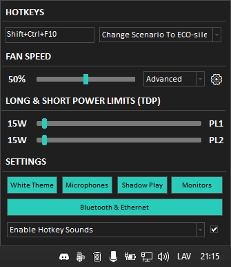
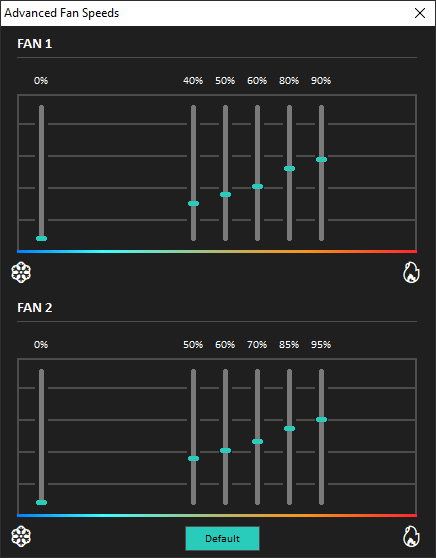
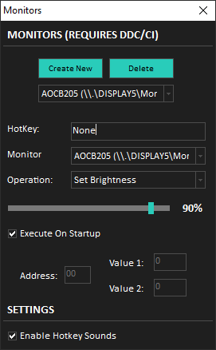

# MSI Control (Vector 16 HX A14VHG)

This is the source code of MSIControl. MSIControl is an application that will allow you to control fans of your MSI computer and other stuff. You probably will not be able to compile this project because it depends on other packages and units, which are not included.

  
  
  

## Features

- Portable.
- Hotkeys Are Configurable.
- Sound Notify On Hotkey.
- Toggle Ethernet Adapter.
- Toggle Keyboard.
- Control Shadow Play.
- Control Fan Speed.
- Control Microphone Volume And Mute.
- Control Bluetooth.
- Control Monitors.
- Set Fixed Volume On Microphone.

## Download
You can download the MSIControl [here](https://github.com/serbinskis/Delphi/raw/master/MSIControl/MSIControl.exe).