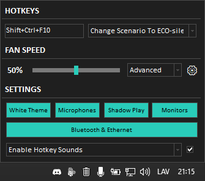

# MSI Control (GL65 9SE)

This is the source code of MSIControl. MSIControl is an application that will allow you to control fans of your MSI computer. For now, it can toggle Cooler Boost and change fan mode and speed. You probably will not be able to compile this project because it depends on other packages and units, which are not included.

## Features

- Portable.
- Hotkeys are configurable.
- Sound notify on hotkey.
- Toggle inbuilt MSI webcam.
- Toggle ethernet adapter.
- Toggle Cooler Boost.
- Control fan speed.
- Control audio.
- Control microphone volume and mute.
- Set fixed volume on microphone.
- Set custom hotkey to change keyboard language.

## Download
You can download the MSIControl [here](https://github.com/WobbyChip/Delphi/raw/main/MSIControl/MSIControl.exe).